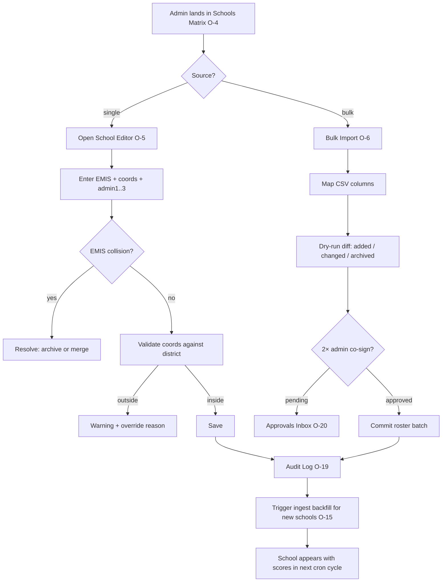
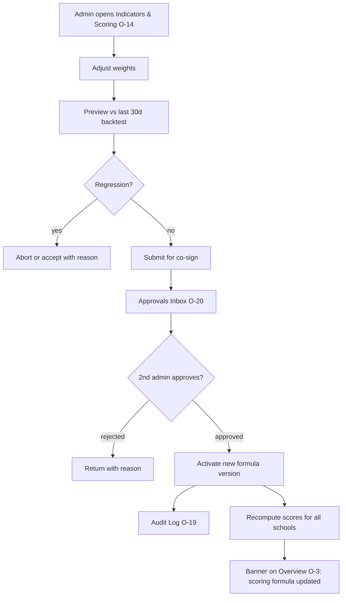
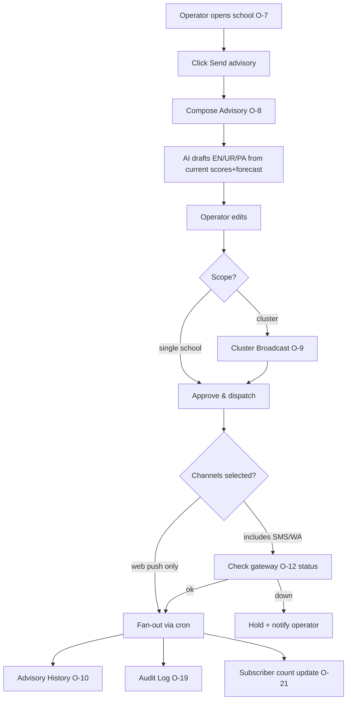
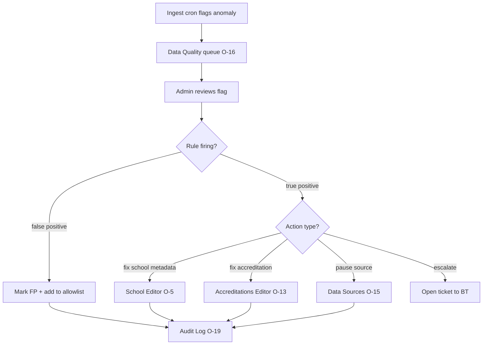
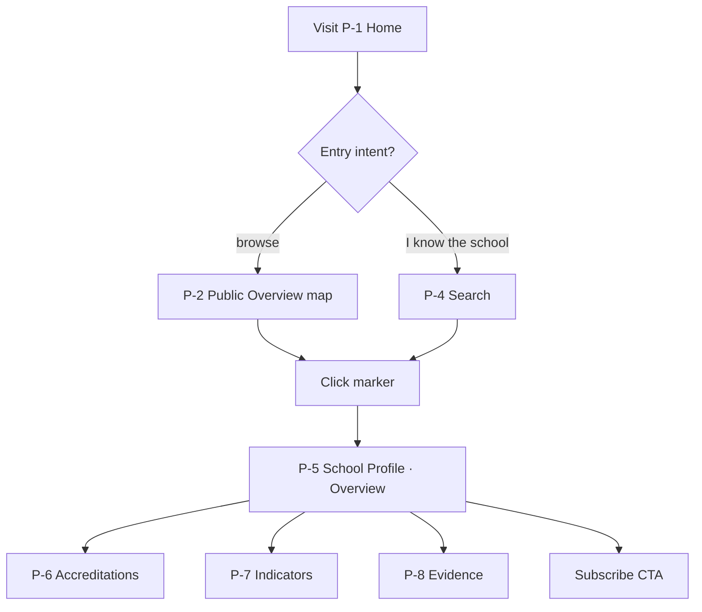
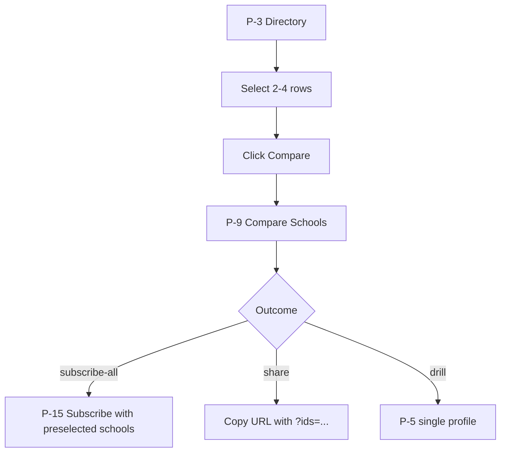
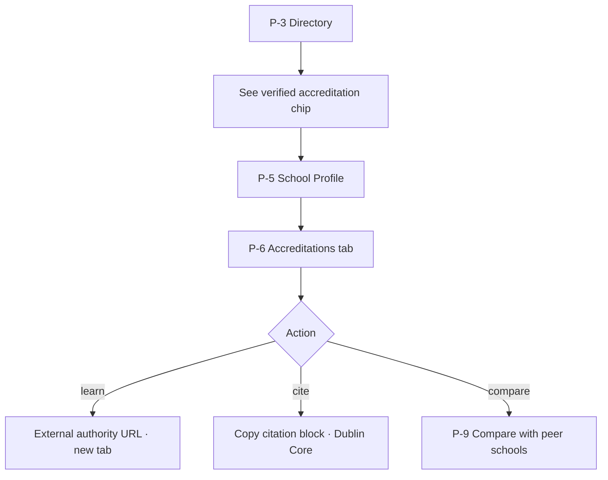
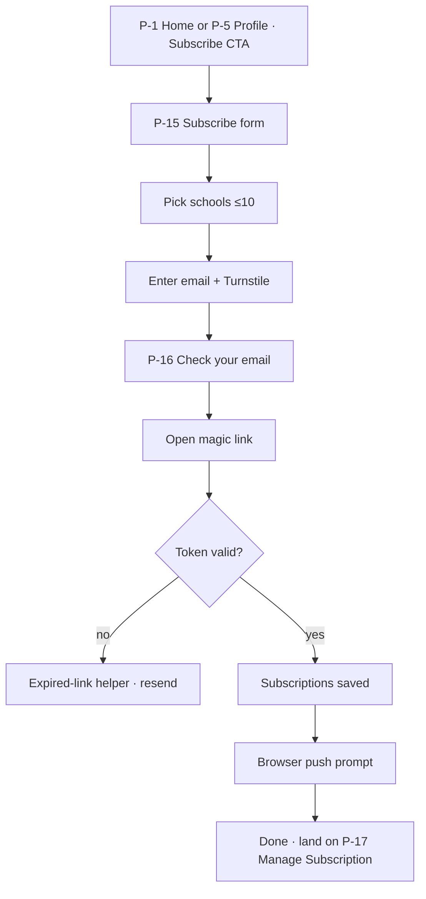
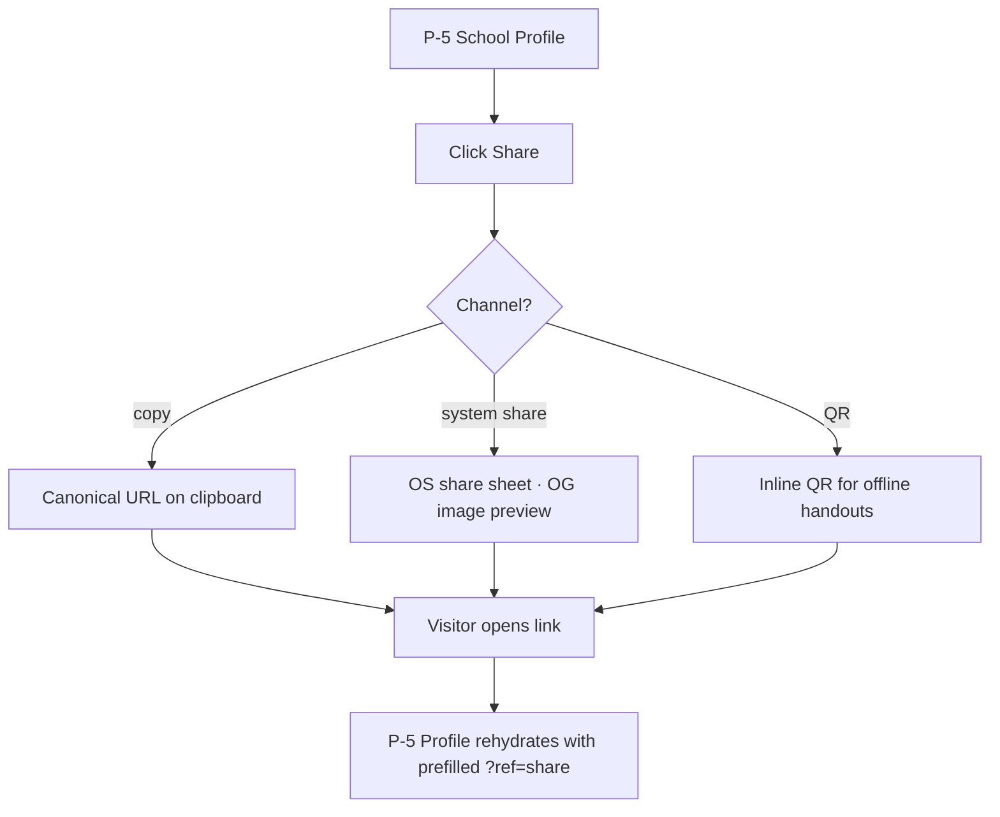

# Screen Inventory & User Flow Map

**Status:** draft v0.1 · 2026-05-17
**Owner:** Reza Malik (BT)
**Scope:** forward-looking inventory of the two user surfaces required to take School Climate Hub from v0.1 (Gujranwala-50 prototype) to v0.2/v0.3 (multi-tenant SaaS + parent reach).
**Source docs cross-referenced:** [PRD.md](./PRD.md), [REQUIREMENTS.md](./REQUIREMENTS.md), [ROADMAP.md](./ROADMAP.md), [v0.2-scope.md](./v0.2-scope.md), [ONBOARDING.md](./ONBOARDING.md), [ACCESS-CONTROL.md](./ACCESS-CONTROL.md), [open_data_layer/schema.md](../open_data_layer/schema.md).

This is **not** a redesign brief; it's the inventory the build needs to satisfy. Existing v0.1 screens are flagged ✅; v0.2 sprint scope (per [v0.2-scope.md](./v0.2-scope.md)) is flagged 🟡; everything else is gap.

---

## 1. Operator Console — Screen Inventory

Operator Console = the surface for verified T2 operators (PDLC), district admins (T2/T3), BT platform admins, and reviewers. Today the entire console is a single anonymous HTML page; v0.2 splits it behind magic-link auth with role-aware navigation.

| # | Screen | Purpose | Role/Audience | Key Data | Primary Actions | States (empty / loading / error) | Connects To |
|---|---|---|---|---|---|---|---|
| O-1 | **Sign-in / Magic-link request** | Email-only auth entry | All authenticated roles | Email, Turnstile token | Request link · Open inbox helper | Unknown email (silent success) · Rate-limited (1/min) · ESP soft-fail | O-2 |
| O-2 | **Magic-link callback** | Verify token, set session | All | Token, redirect target | Auto-redirect to last view | Expired link · Token reuse · Account disabled | O-3 |
| O-3 | **Operator Overview** ✅ | Triage today's hazards across estate | Operator, Admin, Reviewer | Map of N schools · today's alerts · cluster roll-up · child-burden hero · 7-day forecast strip | Send advisory · Modify school day · Defer · Acknowledge · Export PDF | No alerts (calm state) · Ingest stale (banner) · Data load fail | O-4, O-7, O-8 |
| O-4 | **Schools Matrix** ✅ | Sortable RAG list of all schools in tenant | Operator, Admin, Reviewer | Per-school scores (heat/AQ/flood/overall), accreditation chips, burden, last-alert | Click row → drawer · Sort/filter by cluster/hazard | Empty roster · No verified accreditations · Filter yields zero | O-7 (drawer), O-9 |
| O-5 | **School Editor (CRUD)** | Create / edit / archive a school record | Admin (district), BT Admin | EMIS, name, lat/lon, admin1-3, cluster, enrolment, operator, programme, as_of | Save · Validate coords against district · Archive · Restore · Duplicate-check by EMIS | New (empty form) · EMIS collision · Coord outside admin2 · Bulk-edit unsaved | O-4, O-6, O-15 |
| O-6 | **Bulk School Import** | Upload roster CSV; preview diff | Admin | File picker · column mapping · dry-run diff (added/changed/archived) | Upload · Map columns · Approve diff · 2× admin co-sign · Commit | CSV parse error · EMIS collisions · Coord-outside-district warnings · Awaiting co-signer | O-5, O-15, O-19 |
| O-7 | **School Detail Drawer** ✅ | Single-school deep view over any list | All authenticated | Current scores + raw exposure · explainability · forecast sparkline · recent alerts · **Accreditations card** · subscriber count (operator) | Send advisory · Edit metadata (admin) · Open accreditation editor | School archived · No scores yet (ingest pending) · No accreditations · Forecast unavailable | O-3, O-4, O-8, O-10, O-13 |
| O-8 | **Compose Advisory / Dispatch** ✅ (modal today) | Draft + approve advisory; fan-out to channels | Operator | AI draft EN/UR/PA · channel select · audience scope (one school / cluster / all) · template version | AI redraft · Edit · Approve & dispatch · Save as draft · Schedule | AI grounded-refusal · Template missing for hazard · Channel down · Approval timeout · Quiet-hours override | O-7, O-11, O-19, O-12 |
| O-9 | **Cluster Broadcast** ✅ (modal today) | Send same advisory across a cluster | Operator | Cluster ID · school list · per-school deviation toggles | Confirm scope · Approve & dispatch | Empty cluster · Some schools archived · Partial gateway failure | O-4, O-8, O-19 |
| O-10 | **Advisory History / Alerts Feed** | Audit a school's or operator's dispatch history | Operator, Admin, Reviewer | Date · hazard · channels · approver · template version · delivery counts | Re-open as draft · Export · Filter by school/hazard/state | No history · Filter yields zero · Delivery still in-flight | O-7, O-19 |
| O-11 | **Advisory Template Library** | Curate the message templates the AI grounds on | Admin | Per-hazard EN/UR/PA bodies · variables · version history · "active" flag | Create · Clone · Edit · Activate · Diff vs prior · 2× admin commit | No templates (seed state) · Variable missing · Active version locked | O-8, O-19 |
| O-12 | **Channels & Gateway Config** | Configure SMS / WhatsApp / PA gateways per tenant | Admin | Provider · credentials (write-only) · sender IDs · per-channel quotas · status | Add channel · Test send · Rotate creds · Disable | No channels configured · Test failed · Credential expired · Webhook unreachable | O-8 |
| O-13 | **Accreditations Editor** | CRUD per-school accreditation records | Operator (declare) · Admin (verify) | type · tier · year · state ∈ {declared, verified} · evidence URL · verified_by · verified_at | Declare · Attach evidence · Mark verified (2× admin) · Revoke · Bulk import from authority CSV | No accreditations · Declared awaiting verify · Verification expired · Evidence URL unreachable | O-7, O-15, O-19 |
| O-14 | **Indicators & Scoring Config** | Manage hazard scoring inputs and weights | Admin, BT Admin | Per-hazard input list · weights · score formula version · backtest stats | Adjust weights · Preview against last 30d · 2× admin commit · Rollback | No backtest yet · Weights sum ≠ 1 · Formula regression alert | O-7, O-15, O-19 |
| O-15 | **Data Sources & Ingest Status** | Health of upstream pipelines | Admin, BT Admin | Per-source: last-success, freshness SLO, success rate 30d, current run state | Trigger re-run · Pause source · Reconfigure auth · View last error | All green · Source paused · Auth expired · Run in-progress | O-3 (stale banner), O-19 |
| O-16 | **Data Quality / Flagged Records** | Review automated anomaly flags | Admin | Record · rule that fired · severity · proposed action | Approve fix · Reject (mark false-positive) · Bulk-resolve · Escalate to BT | Queue empty · Awaiting reviewer · Conflicting flags | O-5, O-13, O-19 |
| O-17 | **Reference Data / Taxonomies** | Manage controlled vocabularies (cluster codes, hazards, languages, accreditation types, channels) | BT Admin | Term · code · description · status · used-by count | Add · Rename (with migration) · Deprecate · Merge | Terms in use cannot be deleted · Rename pending migration · Conflicting codes | O-5, O-13, O-14 |
| O-18 | **Users, Roles & Permissions** | Manage operator team members | Admin, BT Admin | User · email · role · last-seen · 2FA status · invitation state | Invite · Promote · Demote · Suspend · Force re-auth · Emergency override gates Promote/Remove | No team yet · Invite expired · Last admin cannot demote self · Suspended user re-auth | O-19 |
| O-19 | **Audit Log** | Hash-chained record of every action | Admin, Reviewer, BT Admin | Actor · action · entity · prev_hash · row_hash · payload SHA-256 · IP | Filter · Export CSV · Verify chain · Export single-entry attestation | Chain break (red banner) · Export in-flight · Filter yields zero | every editor screen |
| O-20 | **Approvals Inbox** | Pending 2× admin co-signs across all areas | Admin | Pending item · initiator · age · scope · diff preview | Approve · Reject (with reason) · Defer · Emergency override (FR-N22 limits) | Inbox zero · Approval expired (24h) · Override blocked for Promote/Remove | O-6, O-11, O-13, O-14, O-17, O-18 |
| O-21 | **Subscribers (read-only)** | Counts per school; never addresses | Operator, Admin | Per-school subscriber count · severity-filter mix · quiet-hours adoption | Drill-in by school · Export aggregate stats | No subscribers · Subscription paused (school-wide) | O-7 |
| O-22 | **Operator Settings (org)** | Tenant-wide settings: thresholds, languages, branding, residency, tier | Admin | Hazard thresholds ✅ · active languages ✅ · approval policy ✅ · operator-status card ✅ · data residency · billing tier | Edit (1× or 2× admin per FR-N14..17) · Request tier upgrade | New tenant (defaults) · Pending approval · Residency change requires BT review | O-3 (lives behind nav) |
| O-23 | **DSR / Data-Subject Requests** | Handle access / deletion / portability requests | Admin, BT Admin | Request type · subject · scope · SLA clock · status | Acknowledge · Fulfil · Reject (with reason) · Export bundle | No requests · SLA breach risk · Requires legal sign-off | O-18, O-19 |
| O-24 | **Help / Runbooks (in-app)** | Embedded operator playbook | All | Articles, search, escalation contact | Read · Open ticket · Copy-link | Article not localised · Search miss | O-3 |
| O-25 | **Reviewer View (read-only across tenants)** | UNICEF / BT cross-tenant browse | Reviewer | Per-tenant headline metrics · public + de-identified dispatch counts · audit summaries | Switch tenant · Export digest · No write actions | No tenants in scope · Anonymised counts only · Cross-tenant k-anon floor enforced | O-3, O-4, O-19 |

**Legend:** ✅ shipped in v0.1 · 🟡 in v0.2 scope per [v0.2-scope.md](./v0.2-scope.md) · (no flag) = gap.

🟡 partially covered by v0.2-scope: O-1, O-2, O-7 (drawer), O-8 (compose), O-11 (templates implied), O-15 (Open Data status), O-18 (claim queue is a degenerate case), O-22 (read-only settings in week 1).

---

## 2. Operator Console — Flow Diagrams

### 2.1 Onboard a school (admin path)

### 2.2 Publish a data update (scoring weight change)

### 2.3 Compose and send a broadcast

### 2.4 Handle a flagged record

---

## 3. Public Hub — Screen Inventory

Public Hub = the `schoolclimatehub.org` surface visited by parents, researchers, partners, school staff, and journalists. Today the public root is the v0.1 operator dashboard itself (read-only chrome). v0.2 splits the public surface from authenticated operator views.

| # | Screen | Purpose | Audience | Key Content | Primary CTA | SEO / Share | Accessibility |
|---|---|---|---|---|---|---|---|
| P-1 | **Home / Landing** | Explain the project + funnel to key actions | Everyone | One-sentence pitch · live stat row (schools, alerts today, lost child-school-days) · 3 onboarding cards (what / data / subscribe) | Subscribe · Browse schools | OG image · Title: "School Climate Hub — climate risk for every school" · structured data: `Organization` | Skip-link · landmark roles · reduced-motion · 4.5:1 contrast on hero |
| P-2 | **Public Overview / Map** ✅ | At-a-glance hazard view of all pilot schools | Parents, partners | Leaflet map · cluster pill filter · today's red/amber count · forecast strip | Open school · Subscribe | Per-cluster meta tags · share-as-image of cluster | Map alt-text · keyboard-pan · marker `aria-label` · cluster table parity |
| P-3 | **School Directory** ✅ | Browse / search the 50 schools | Parents, researchers | Sortable RAG matrix · accreditation chips · cluster filter · burden column | Open school · Subscribe per row | Crawlable HTML table · canonical URL per filter | Sortable headers with `aria-sort` · row focus ring |
| P-4 | **Search (header)** 🟡 | Fuzzy-find a school by name or EMIS | Everyone | Combobox with type-ahead · keyboard nav · clustered results | Jump to school | URL preserves query for share | Combobox ARIA · ESC clears · live region for result count |
| P-5 | **School Profile — Overview** ✅ (drawer today, page in v0.2) | Single-school landing | Parents, school staff | Identity card · current scores · 15-day forecast sparkline · last advisory | Subscribe · Share · Open methodology | Canonical `schoolclimatehub.org/s/<emis>` · OG image with school + score chips · `Place` + `EducationalOrganization` schema | H1 = school name · printable · `lang="ur"` on Urdu fields |
| P-6 | **School Profile — Accreditations** ✅ (drawer today) | Show verified green-school accreditations | Parents, evaluators | Per-record card: label · authority · year · summary · evidence link | Learn more (authority URL) | Sub-anchor `#accreditations` · structured data `EducationalCredential` per record | Card-per-record (no tooltip dependency); colour + text label, not colour alone |
| P-7 | **School Profile — Indicators** | Hazard inputs and how they roll up to the score | Researchers, advanced parents | Per-hazard panel: top inputs, weights, "Why this score?" | Open methodology | Sub-anchor `#indicators` | Tabular fallback for charts · description text alongside sparkline |
| P-8 | **School Profile — Evidence / Sources** | Trace each datapoint to its source | Researchers, partners | List of sources · licence · last refresh · per-source citation block | Download source bundle | Sub-anchor `#evidence` · Dublin Core `<meta>` for sources | Citation chunks have associated heading; list-item semantics |
| P-9 | **Compare Schools** | Side-by-side hazard + accreditation view | Parents, researchers | Up to 4 schools · score matrix · forecast overlay · accreditation parity | Share comparison · Subscribe to all | URL-driven (`?ids=...`) for shareable view · OG image with compared chips | Each column tabbable · screen-reader announces column header on focus |
| P-10 | **Open Data** ✅ | Real downloads + API docs | Researchers, partners | Dataset cards (schools, exposure_daily, exposure_school_year, vulnerability_scores, **accreditations**) · OpenAPI spec link · last-refresh · CC BY 4.0 | Download · View API · Cite this dataset | Datasets discoverable via `DataCatalog` schema · DOI placeholder · sitemap entry | Card → file table fallback · contrast on download buttons |
| P-11 | **Methodology** | Explain scoring, attendance, and limitations honestly | Researchers, sceptics | Per-hazard methodology · attendance caveat (correlation ≠ causation) · backtest stats | Cite methodology · Download paper draft | `ScholarlyArticle` schema · canonical anchor per section | Long-form readable at 400% zoom · footnote `<aside>` semantics |
| P-12 | **About** ✅ | Project, partners, funding, governance | Everyone | PDLC + BT co-equal acknowledgement · funders · governance note · contact | Contact · Read PRD | OG image with partner marks · `Organization` schema | Logo `alt` text · partner logos as text alt |
| P-13 | **For Operators** | Funnel verified operators to claim | School chains, NGOs, ministries | T1/T2/T3 ladder · what verification needs · timelines · ToS / DPA links | Apply · Sign in | OG image · search-indexed for "school dashboard pakistan" | Plain-language summary alongside legal text |
| P-14 | **Apply (T2 claim form)** | Operator claim entry | Operators | Legal entity · registry # · claimed EMIS list · evidence upload · reference contact | Submit application | Noindex (form page) | Form labels, error summary at top, async-save indicator |
| P-15 | **Subscribe** 🟡 | Email-only subscription flow | Parents | School picker (multi-select ≤10) · email field · Turnstile · severity filter · quiet hours | Send magic link | Noindex (form) · share-friendly preselected URL `?school=<emis>` | Form-field error messaging · Turnstile fallback · clear consent copy |
| P-16 | **Inbox helper / Check your email** 🟡 | Post-subscribe holding page | Subscribers | Instruction text · resend (rate-limited) · troubleshooting | Resend · Use a different email | Noindex | Live region announces "sent" |
| P-17 | **Manage Subscription (tokenised)** 🟡 | Edit prefs without an account | Subscribers | Signed token URL from notification · school list · severity · quiet hours · pause | Save · Unsubscribe all | Noindex · token in URL, no PII rendered | One-click unsubscribe · plain-text confirmation page |
| P-18 | **Alert Detail (public)** | Public-facing view of an active advisory | Anyone with link | School · hazard · advisory text (EN/UR/PA) · timestamp · "what to do" tips · share | Subscribe to this school · Share | Canonical `…/alerts/<id>` · OG image with hazard tag · `NewsArticle` schema | RTL handled per language · skip-to-action link |
| P-19 | **Contact** | Reach the team | Partners, journalists, support | Routed inbox (support / press / partnerships) · response-time SLA · status link | Send message | `ContactPoint` schema | Form labels · success/error live regions · spam protection accessible |
| P-20 | **Privacy / Terms / DPA / Disclaimer** ✅ (DISCLAIMER.md) | Legal commitments | Everyone | Full text · last-updated date · counsel sign-off line | Print · Email a question | Each policy has canonical URL + version anchor | TOC navigable by H2; reading-level note |
| P-21 | **Status / Uptime** | Real-time platform status | Operators, journalists | Per-component status · incident history · subscribe to status RSS | Subscribe to RSS | RSS feed · noindex incident-detail | Status colour + text label (not colour alone) |
| P-22 | **404 / 410** | Graceful not-found | Everyone | Helpful copy · search · "did you mean" by EMIS | Search · Home | Server 404 status; no soft-404 | H1 readable · keyboard-reachable search |
| P-23 | **Language switch (header)** 🟡 | EN / UR / AR / FR + RTL | Everyone | Language picker · current language · auto-detect notice | Choose | Preserve query string and anchor across switch · `hreflang` alternates | `lang=` attribute swap · direction switch announced by SR |

**Legend:** ✅ shipped in v0.1 (drawer-as-profile or single-page form) · 🟡 in v0.2 scope · (no flag) = gap.

---

## 4. Public Hub — Flow Diagrams

### 4.1 Discover a school

### 4.2 Compare two schools

### 4.3 Drill into an accreditation

### 4.4 Subscribe to updates

### 4.5 Share a profile

---

## 5. Gap Analysis (vs. current `/Users/rezamalik/Repo/school-climate-hub` build)

| Area | Inventory requires | Today (v0.1) | v0.2 sprint covers | Gap |
|---|---|---|---|---|
| **Auth** | O-1, O-2, P-15..P-17 | None (anonymous HTML) | Lucia magic-link, Turnstile, signed tokens | Federated SAML/OIDC for T3 ministries (not in v0.2) |
| **Schools CRUD** | O-5, O-6 | Static `data/schools/pssp_psrp_50.csv` · no UI | Read-only roster in week 1 | Editor, bulk-import, dry-run diff, EMIS collision UX — **all gap** |
| **Accreditations CRUD** | O-13 | Verified records hard-coded in `index.html` `ACCREDITATIONS` map | Read-only render only | Editor + declared→verified workflow + bulk import — **all gap** |
| **Indicators / scoring config** | O-14 | Server-side Python; no operator UI | Not in v0.2 | Operator-facing weights / backtest UI — gap (v0.3+) |
| **Data sources & ingest status** | O-15 | `scores.json`, `attendance.json` written by cron; no surface | Open Data downloads · ingest cron lives on Worker | Health dashboard, freshness SLO, re-run trigger — **gap** |
| **Data quality / flagged records** | O-16 | None | Not in v0.2 | Anomaly queue + bulk resolve — **gap (v0.3)** |
| **Reference data / taxonomies** | O-17 | Hard-coded in HTML (cluster codes, hazard list, languages, badge types) | Not in v0.2 | Editable taxonomies with usage counts and rename-with-migration — **gap (v0.3+)** |
| **Users / roles / permissions** | O-18 | Mock team-manager modal only | Admin claim queue is the degenerate case | Full invite/promote/demote/2FA/emergency-override UI — **partial gap** |
| **Audit log** | O-19 | Not surfaced anywhere | Backend hash-chain noted in PRD §4 FR-N20..21; UI not in v0.2 | Audit-log viewer + chain-verification UI — **gap** |
| **Approvals inbox** | O-20 | None | Implied by 2× admin requirements in PRD §6; no centralised inbox planned in week 3 | Cross-area approvals inbox — **gap** |
| **Subscriber counts (read-only)** | O-21 | None | Yes (per v0.2 Dispatch screen) | Likely covered by v0.2 |
| **Operator settings (org)** | O-22 | Mock card with mock data | Read-only in week 1 | Writeable settings with 2× co-sign — partial gap |
| **DSR handling** | O-23 | Mentioned in PRD FR-N28 (DSR) | Not in v0.2 sprint | Gap (privacy posture demands by GA) |
| **Help / runbooks** | O-24 | README, docs in repo | Not in v0.2 | In-app help — gap |
| **Reviewer view** | O-25 | None | Reviewer role exists in v0.2 role table; no cross-tenant view | Cross-tenant browse — gap |
| **Public Home / onboarding** | P-1 | Dashboard is the root after [2722e2a](school-climate-hub/2722e2a) | "App explains itself" + 3 onboarding cards per v0.2-scope §4 | Likely covered; image/OG generation gap |
| **Public Search** | P-4 | None | In v0.2 top bar | Covered |
| **School Profile as a page** | P-5..P-8 | Drawer only | Detail page with forecast sparkline in v0.2 | Indicators tab + Evidence tab — **partial gap** |
| **Compare schools** | P-9 | None | Not in v0.2 | Gap (v0.3 nice-to-have) |
| **Methodology long-form** | P-11 | `docs/methodology-attendance.md` only | Not explicitly in v0.2 | Public-facing page — **gap** |
| **For Operators / Apply** | P-13, P-14 | None | School-claim flow in week 3 | Public funnel + multi-step apply form — partial gap |
| **Public Alert Detail** | P-18 | Modal only | Not in v0.2 | Canonical alert URL with OG image — **gap** |
| **Contact** | P-19 | Email only (no UI) | Not in v0.2 | Routed inbox + status integration — gap |
| **Privacy / Terms / DPA** | P-20 | DISCLAIMER.md only | "Counsel-reviewed Privacy / Terms" in week 2 | Versioned, anchored, published — partial gap |
| **Status / Uptime** | P-21 | None | Not in v0.2 | Gap (post-launch) |
| **404 / 410** | P-22 | GH Pages default | Not in v0.2 | Custom 404 with search — gap |
| **i18n switcher** | P-23 | Modal explainer only | EN/UR week 1 · AR/FR week 3 | Largely covered |

---

## 6. Prioritisation

Rule of thumb: **P0 = required for v0.2 to be usable end-to-end** (subscribe + receive a real alert + operator dispatches); **P1 = required before GA at scale** (managing more than one tenant, multiple operators, audit defensibility); **P2 = post-GA polish / v0.3+ growth surfaces**.

### Operator Console

| Priority | Screens | Rationale |
|---|---|---|
| **P0** | O-1 Sign-in · O-2 Callback · O-3 Overview · O-4 Schools Matrix · O-7 School Drawer · O-8 Compose · O-10 Advisory History · O-12 Channels (minimum web-push) · O-22 Operator Settings (read+thresholds) | Closes the v0.2 success criteria: an operator can sign in, see hazards, compose, approve, dispatch, audit dispatch. |
| **P1** | O-5 School Editor · O-6 Bulk Import · O-9 Cluster Broadcast · O-11 Template Library · O-13 Accreditations Editor · O-15 Ingest Status · O-18 Users & Roles · O-19 Audit Log · O-20 Approvals Inbox · O-21 Subscribers · O-25 Reviewer view | Required before onboarding the second tenant. Audit log + approvals inbox are the legal-defensibility floor. |
| **P2** | O-14 Scoring Config · O-16 Data Quality · O-17 Taxonomies · O-23 DSR · O-24 In-app Help | Power-user / governance / scale; can be served by BT-internal tooling until tenant count grows. |

### Public Hub

| Priority | Screens | Rationale |
|---|---|---|
| **P0** | P-1 Home · P-2 Overview · P-3 Directory · P-4 Search · P-5 School Profile Overview · P-6 Accreditations · P-10 Open Data · P-12 About · P-15 Subscribe · P-16 Inbox helper · P-17 Manage Subscription · P-20 Privacy/Terms · P-23 Language switch | Hits the v0.2 success criterion: a parent can find their school and subscribe end-to-end in EN+UR. Open Data + About + Privacy/Terms are legal/credibility table-stakes. |
| **P1** | P-7 Indicators · P-8 Evidence · P-11 Methodology · P-13 For Operators · P-14 Apply · P-18 Alert Detail (canonical share URL) · P-19 Contact · P-22 404 | Builds researcher/partner credibility and operator funnel; needed before press push or UNICEF-funded scale-up. |
| **P2** | P-9 Compare · P-21 Status/Uptime | Growth / trust polish; not blocking. |

---

## 7. Cross-references

- Functional requirements: [PRD.md §4 + §6](./PRD.md) — most of these screens are the UI surface for FR-N1..FR-N30.
- v0.1 acceptance: [REQUIREMENTS.md §7](./REQUIREMENTS.md) — operator demonstrability of 9 jobs-to-be-done.
- v0.2 sequencing: [v0.2-scope.md §10](./v0.2-scope.md) — week-by-week build order.
- T0/T1/T2/T3 tier semantics: [ONBOARDING.md](./ONBOARDING.md).
- PII boundaries / RLS-ABAC matrix: [ACCESS-CONTROL.md](./ACCESS-CONTROL.md).
- Open dataset surfaces (P-10, O-15): [open_data_layer/schema.md](../open_data_layer/schema.md).
